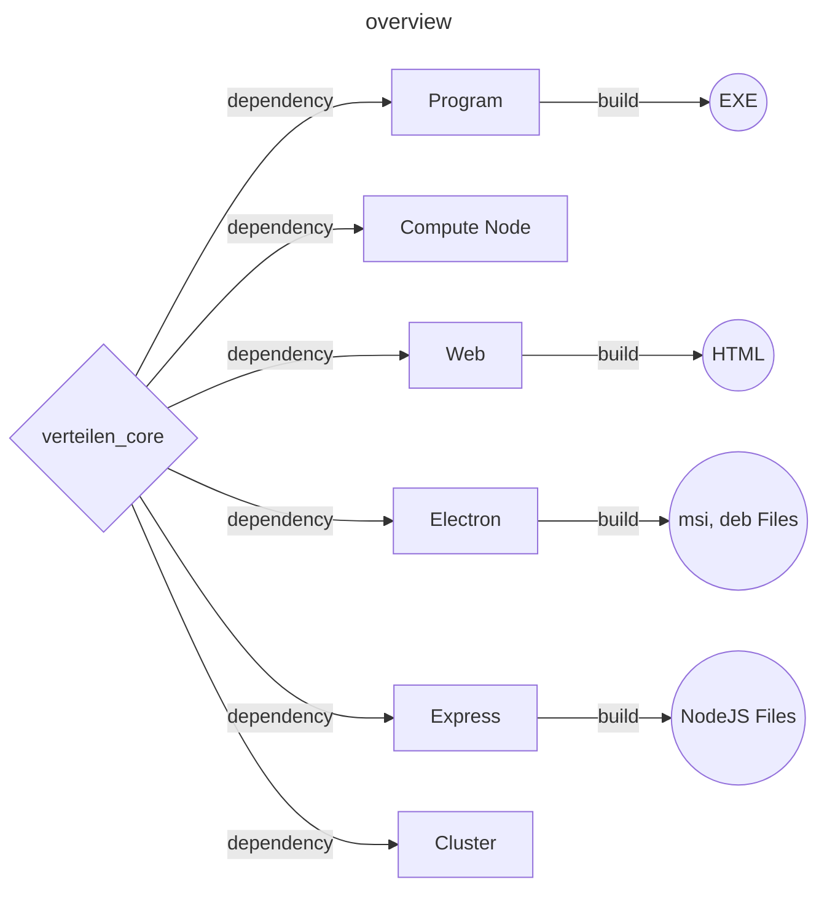
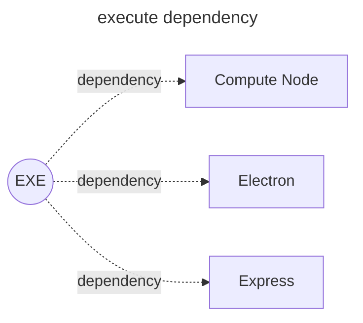
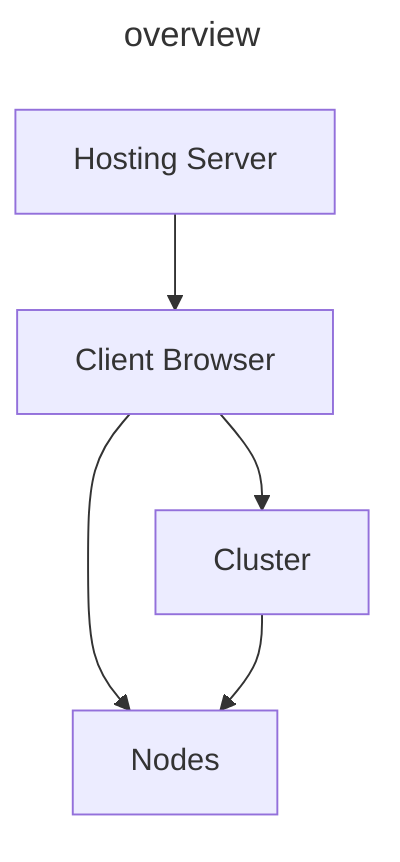
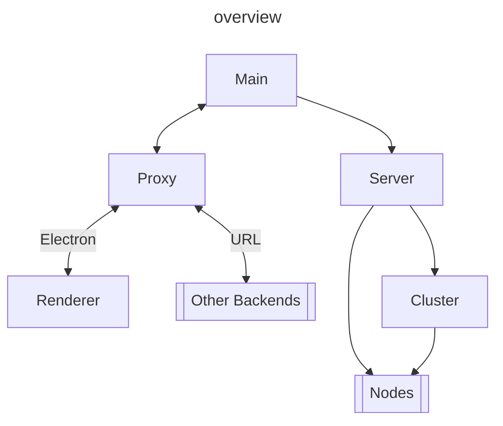
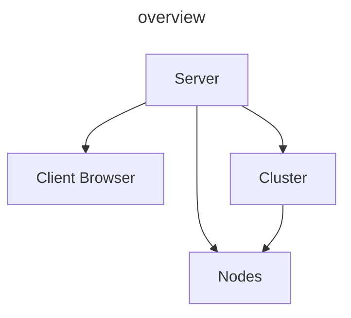

# Project Structure



<br /><br />



## Share

It's a codebase which share in different application

!!! info "Source code location"
    It's locate at [Verteilen-Core](https://github.com/Verteilen/Verteilen-Core)

!!! message ""Update Share" Action"
    Which update the core library
    ```bash
    # It will print out the library version to console
    npm i verteilen-core && cat package.json | grep core
    ```

## Worker

The executable program which run the task logic on it.<br />
This program is called by runner. In order to implement multithread logic in NodeJS environment

!!! info "Source code location"
    It's locate at [here](https://github.com/Verteilen/worker)

!!! message "Build program"
    Use command below to package the program to executable file
    ```bash
    # Build exe depend on current os
    npm run pkg
    # Build worker.exe which run on windows
    npm run pkg win
    # Build worker.exe which run on mac
    npm run pkg mac
    # Build worker.exe which run on linux
    npm run pkg linux
    ```
    The output will locate at ./bin folder

## Runner

### Static Web



Simple task management host by browser, which it close when user close browser <br />
It's unreliable you could said, But easy deploy

Notices:

- [ ] Backend
- [ ] Playground
- [ ] Authentication

!!! info "Source code location"
    It's locate at [Verteilen](https://github.com/Verteilen/Verteilen) <br />
    Currently official Github page repository is [Here]([Static-Web](https://github.com/Verteilen/.github))

!!! message "Build html"
    Use command below to use vite package the renderer to html files
    ```bash
    # Output html files
    npm run build:web
    ```
    The output will locate at ./build/renderer folder

### Electron Application



#### [Proxy](../API/Common/Classes/Proxy.en.md)

It's a way to communicate with backend, depends on the current [application configuration](../API/Common/Type/AppConfig.en.md)

#### Main

Electron desktop application backend

#### Renderer

This renderer will be sharing with other project

#### Server

Verteilen server instance

Notices:

- [x] Backend
- [x] Playground
- [ ] Authentication

!!! info "Source code path location"
    It's locate at [Verteilen](https://github.com/Verteilen/Verteilen) <br />
    Frontend locate at src/renderer <br />
    Backend locate at src/main

!!! message "Build electron"
    Use command below to package the electron app to installation files
    ```bash
    # Build electron app depend on current os
    npm run build
    # Build electron app which run on windows (.msi)
    npm run build:win
    # Build electron app which run on mac
    npm run build:mac
    # Build electron app which run on linux (.deb)
    npm run build:linux
    ```
    The output will locate at ./dist folder

### Express Server



Notices:

- [x] Backend
- [x] Playground
- [x] Authentication

It's nodejs express server which hosting the backend

!!! info "Source code path location"
    It's locate at [Verteilen-Server](https://github.com/Verteilen/Verteilen-Server)

!!! message "Build express"
    Use command below to package the express to nodejs deploy files
    ```bash
    # Output nodejs files
    npm run build:server
    ```
    The output will locate at ./build/server folder

### Compute Node

It's the client side application, it recevied server signal and do the calculation then return the info etc... <br />
It runs without user interface

!!! info "Source code path location"
    It's locate at src/node

!!! message "Build node"
    Use command below to package the express to nodejs deploy files
    ```bash
    # Output nodejs files
    npm run build:node
    ```
    The output will locate at ./build/node folder


### Cluster