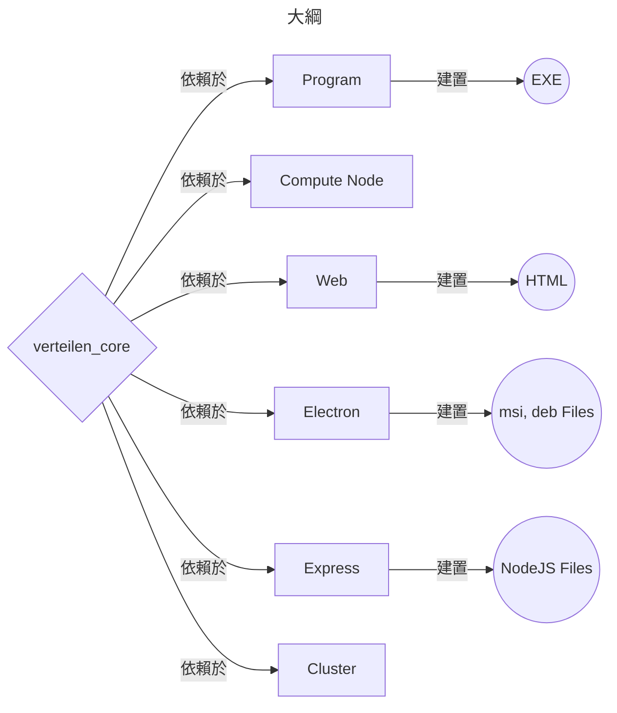
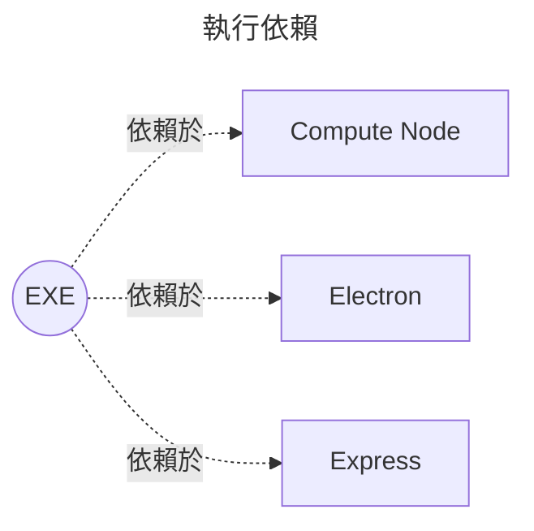
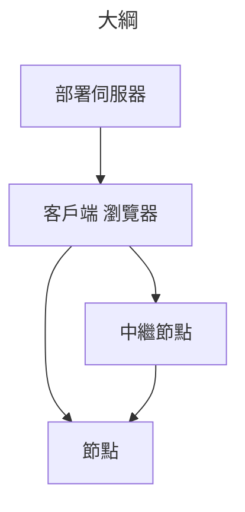
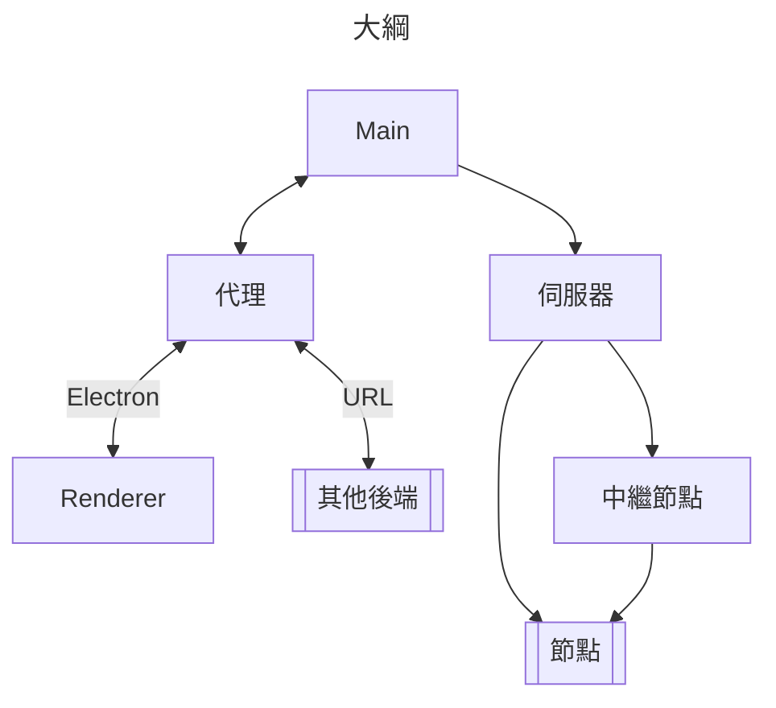
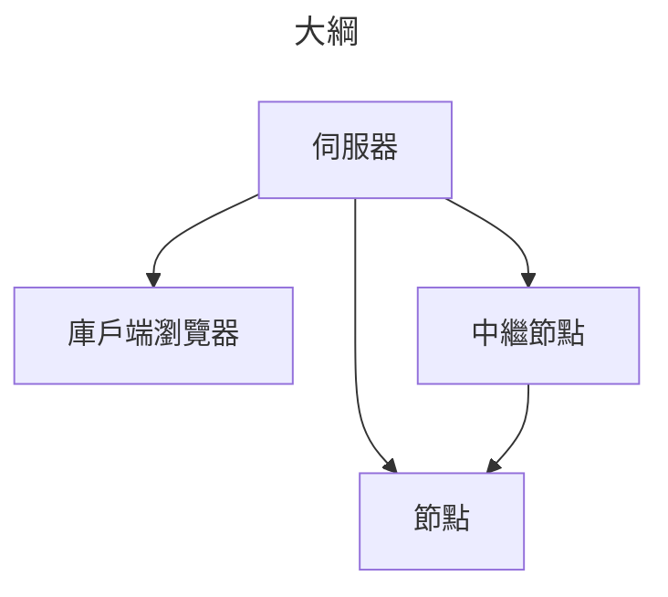

# 專案結構



<br /><br />



## 共享

共享到名個專案的腳本

!!! info "原始碼連結"
    連結附上於 [Verteilen-Core](https://github.com/Verteilen/Verteilen-Core)

!!! message ""更新" 動作"
    更新核心庫
    ```bash
    # 會將下載的核心庫版本打印出來
    npm i verteilen-core && cat package.json | grep core
    ```

## 工作者

這個執行檔將會用於流程的運算 <br />
透過執行者呼叫, 生成 Thread 實體, 爲了在 NodeJS 環境實現多核心

!!! info "原始碼連結"
    連結附上於 [here](https://github.com/Verteilen/worker)

!!! message "建置程式"
    用以下指令進行打包
    ```bash
    # 根據目前作業系統打包
    npm run pkg
    # 打包 Window 平台用執行檔
    npm run pkg win
    # 打包 MacOS 平台用執行檔
    npm run pkg mac
    # 打包 Linux 平台用執行檔
    npm run pkg linux
    ```
    輸出會在 ./bin 資料夾

## 執行者

### 靜態網頁



由瀏覽器架設的工作排序管理程式, 當瀏覽器關閉自動結束 <br />
十分不穩定, 但是很容易架設簡單

Notices:

- [ ] 後端
- [ ] 腳本運作環境
- [ ] 認證

!!! info "原始碼位置"
    位於 [Verteilen](https://github.com/Verteilen/Verteilen) <br />
    Github Page 的預覽位於 [這裡]([Static-Web](https://github.com/Verteilen/.github))

!!! message "建置 html"
    使用以下指令建置 html 檔案
    ```bash
    # 輸出 html 檔案
    npm run build:web
    ```
    輸出檔案位於 ./build/renderer 資料夾

### Electron 桌面應用



#### [代理](../API/Common/Classes/Proxy.zh-TW.md)

與後台溝通的代理物件, 根據目前的 [配置](../API/Common/Type/AppConfig.zh-TW.md)

#### Main

Electron 的桌面應用後端

#### Renderer

這個 renderer 的內容將會共享到其他專案使用

#### 伺服器

Verteilen 伺服器實體

Notices:

- [x] 後端
- [x] 腳本運作環境
- [ ] 認證

!!! info "原始碼位置"
    位於 [Verteilen](https://github.com/Verteilen/Verteilen) <br />
    前端位於 src/renderer 資料夾 <br />
    後端位於 at src/main 資料夾

!!! message "建置 electron"
    使用以下指令建置安裝檔
    ```bash
    # 建置 根據目前作業系統
    npm run build
    # 建置 windows (.msi)
    npm run build:win
    # 建置 mac
    npm run build:mac
    # 建置 linux (.deb)
    npm run build:linux
    ```
    輸出檔案位於 ./dist 資料夾

### Express 網頁後端



Notices:

- [x] 後端
- [x] 腳本運作環境
- [x] 認證

一個由 NodeJS Express 網頁後端架設的伺服器

!!! info "原始碼位置"
    連結附上於 [Verteilen-Server](https://github.com/Verteilen/Verteilen-Server)

!!! message "建置 express"
    使用以下指令輸出 nodejs 檔案
    ```bash
    # 輸出 nodejs 檔案
    npm run build:server
    ```
    輸出檔案位於 ./build/server 資料夾

### 運算節點

It's the client side application, it recevied server signal and do the calculation then return the info etc... <br />
It runs without user interface

!!! info "Source code path location"
    It's locate at src/node

!!! message "Build node"
    Use command below to package the express to nodejs deploy files
    ```bash
    # Output nodejs files
    npm run build:node
    ```
    The output will locate at ./build/node folder


### 中繼節點