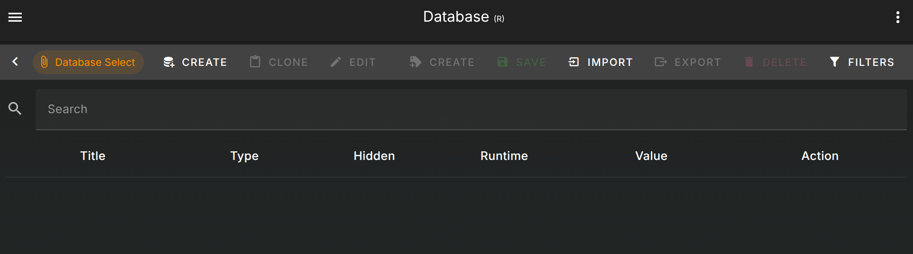
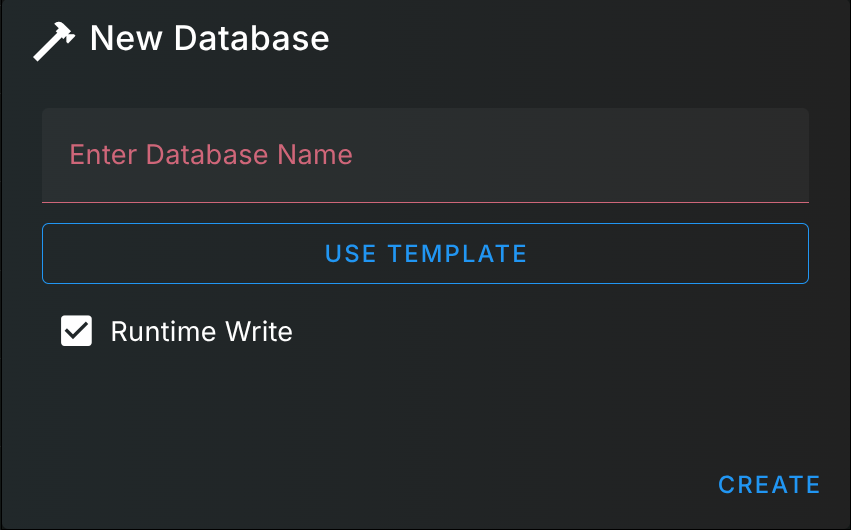
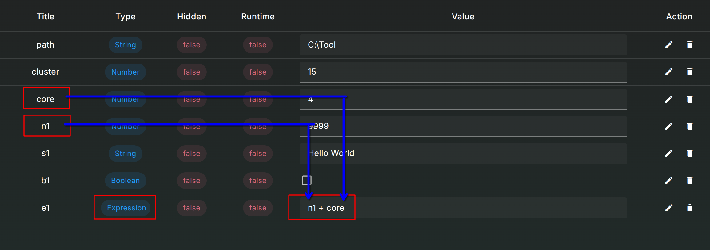

# Database

A variables holder container, User can modify them during the compute stage as well.

## Views

The database page location

In this page, you can do everything in the action bar

* Added database
* Export database
* Added Variable
* etc...

## Add Database

Click top left corner for creating a new database

You must enter name to create  
You can also apply template for the database

Click the template in the group and hit confirm

The button text will change to current select template

## Select Database

Click the database name for select another database

## Add Variable

Click top right corner for creating a new variable

You must enter name to create

You can select different datatype for the variable you are about to create

This is the special datatype, the detail is in the next section

## Expression

Checkout [Expression](https://www.npmjs.com/package/expressionparser) for language details

Expression is execute during the compute stage, The value here is expression string, which is not the result yet  
In this case the expression will be 4 + 9999, then it will return 10003 and store in e1 variable container

