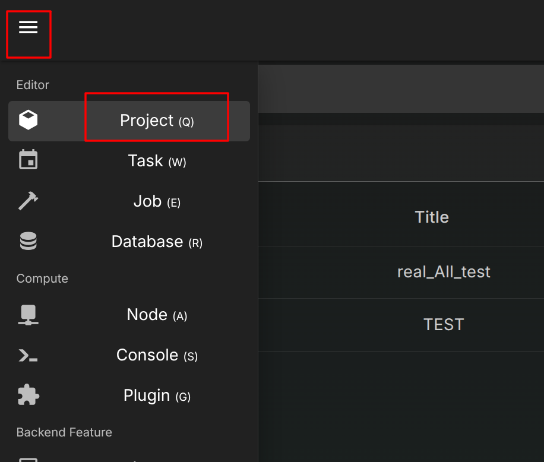
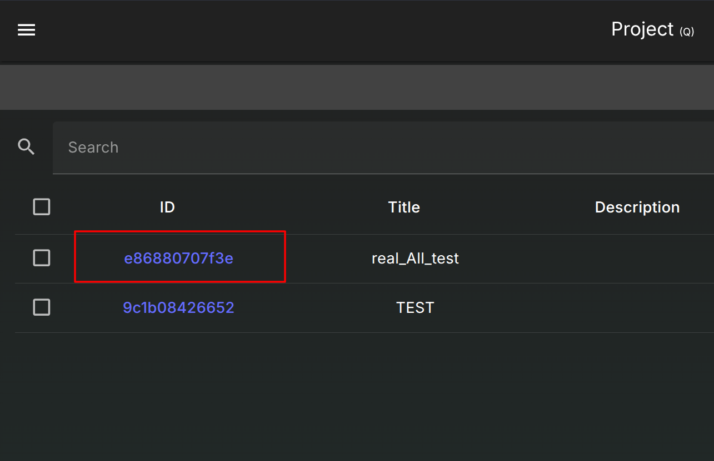

# Project

A container which holds the information about the tasks schedule configuration

## Overview

For manage the project, you want to enter the project page

In this page, you can do everything in the action bar

* Added project
* Export project
* etc...

Click the UUID to quickly enter the task scheduler manage page

## Add New Project

Let's Trying to added a project

As you can see, you must enter the name, otherwise the menu will not accept

Next, We can choose template for the task schedule as well  
if you did not choose, this will create a blank project with 0 task in it

The template select menu here, you can open the group, choose the one

The template button will change the text to which one you select

You can choose the default binding parameter in here as well

After finish, you hit "create"