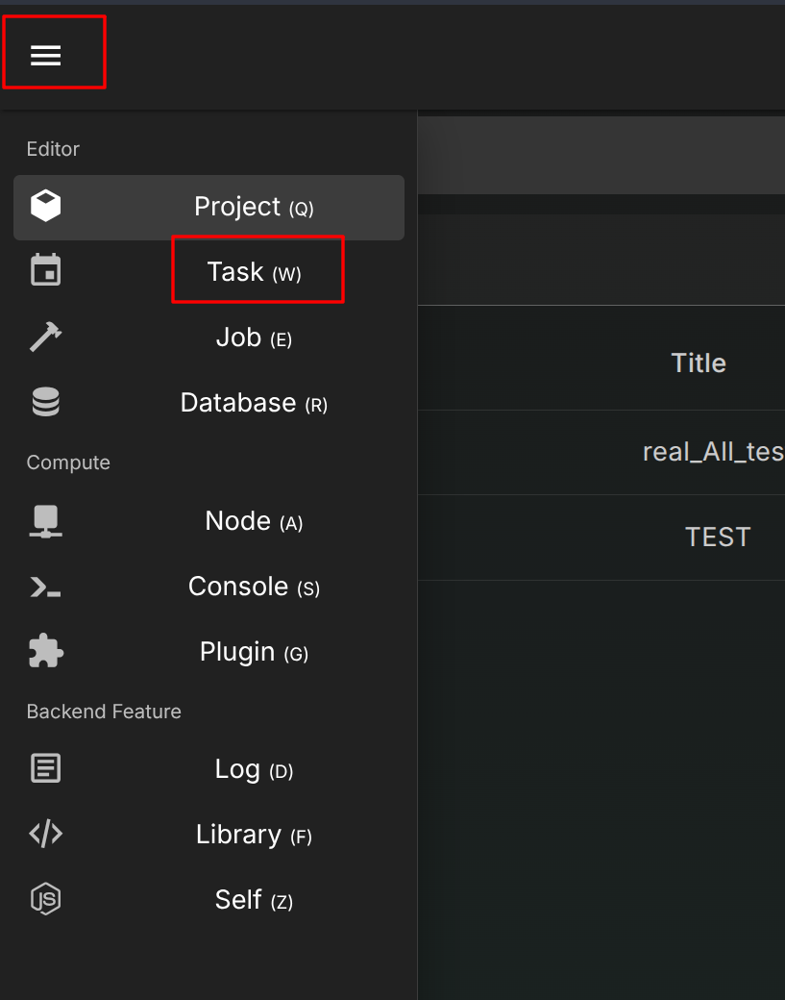
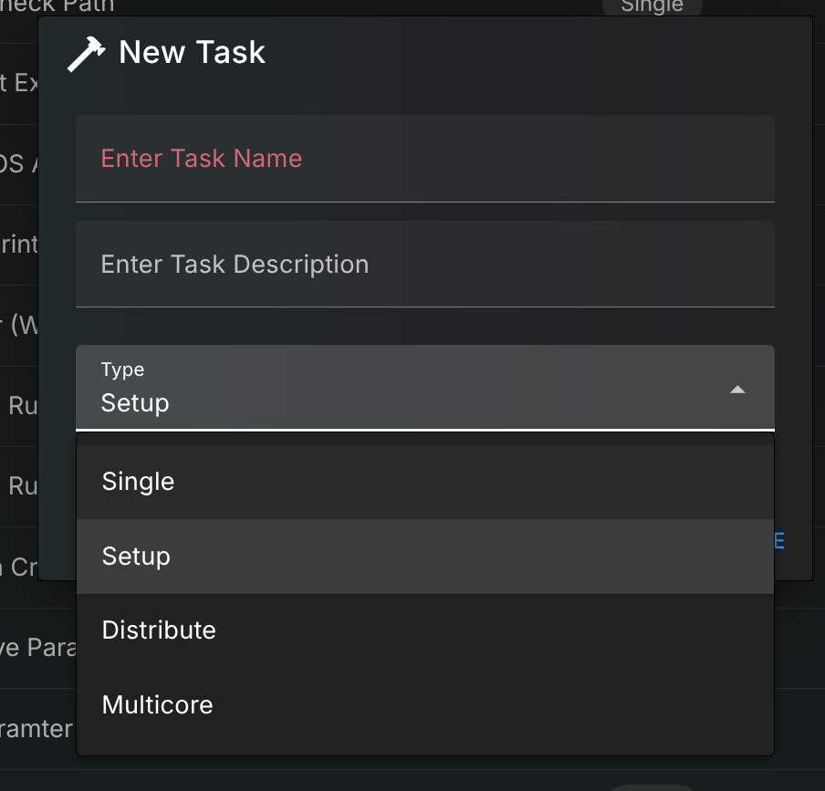
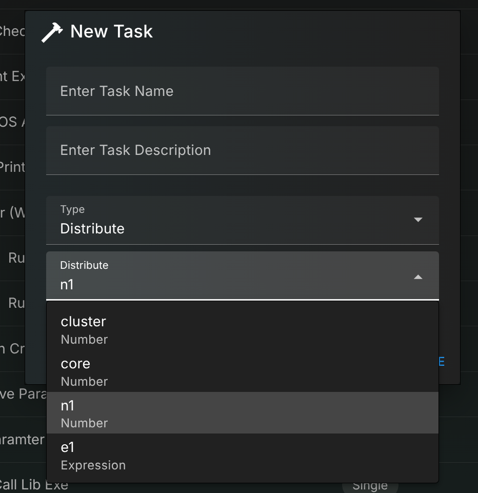
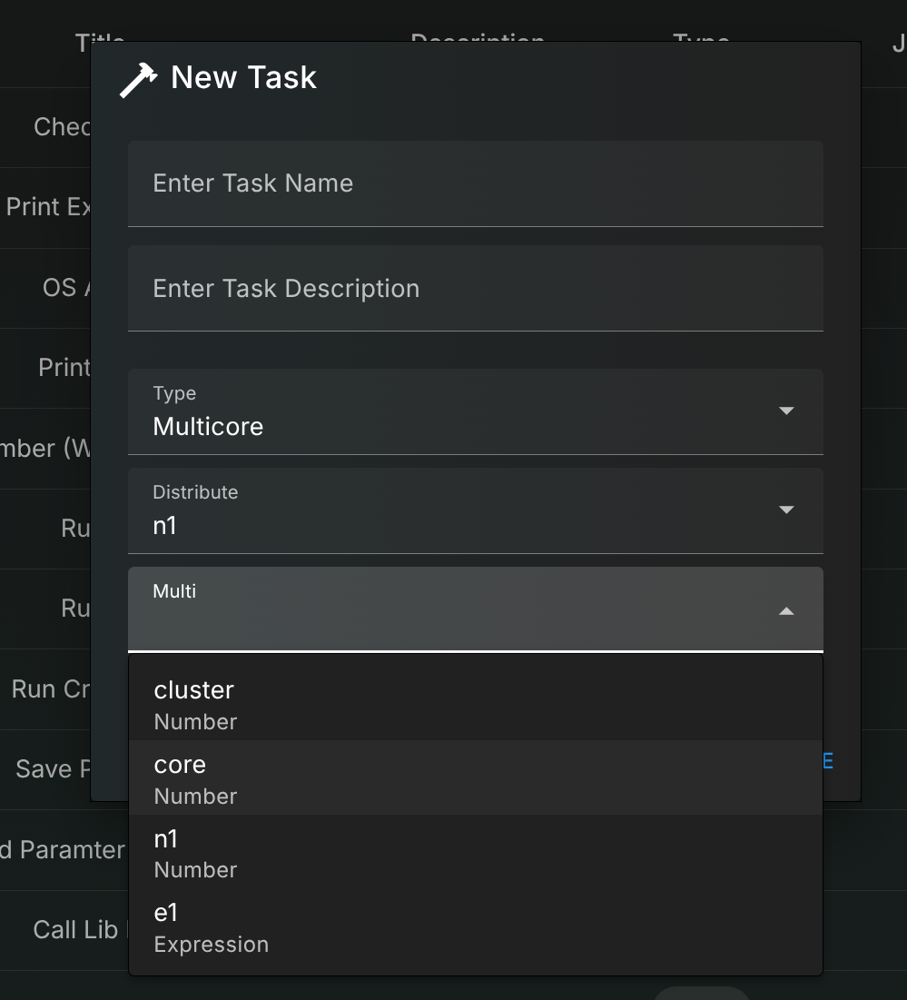

# Task

## Views

The task page location

In this page, you can do everything in the action bar

* Added task
* Export task
* etc...

## Add New Task

Click button to add task

As you can see, you must enter the name, otherwise the menu will not accept

You can choose task execute mode by dropdown menu here

Or you can choose distribute, which let this be a cronjob type  
It will generate a number of subtask that use every nodes to finish it

!!! Warning "Execute Order"
    No It does not have order like, first node run first job, second node run second job  
    As long as the node finish the current subtask, it will fetch the next unfinish subtask  
    It run as quickly as possible

With multicore checked, One node can have multiple subtask execute at the same time

!!! Warning "Compute Heavy"
    If your task have cpu or gpu heavy compute task  
    We recommand you not to check this  
    It should be use on the lightweight task such as transcoding or formating json etc...

## Binding

It's a project binding database, It's just a default binding to a data vault  
You can actually leave this empty, You can assign it in the console page as well

* Click green text to jump to database setting menu  
* Click dotted box to select other database

* Click None to unbind
* Click other to change binding

This is what you see when project is binding to nothing

