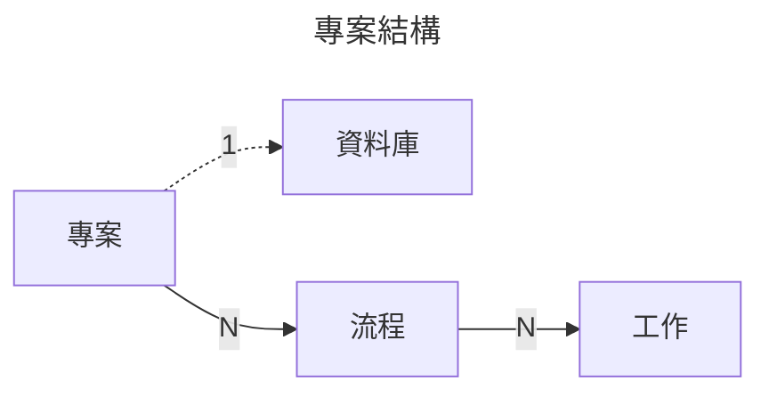
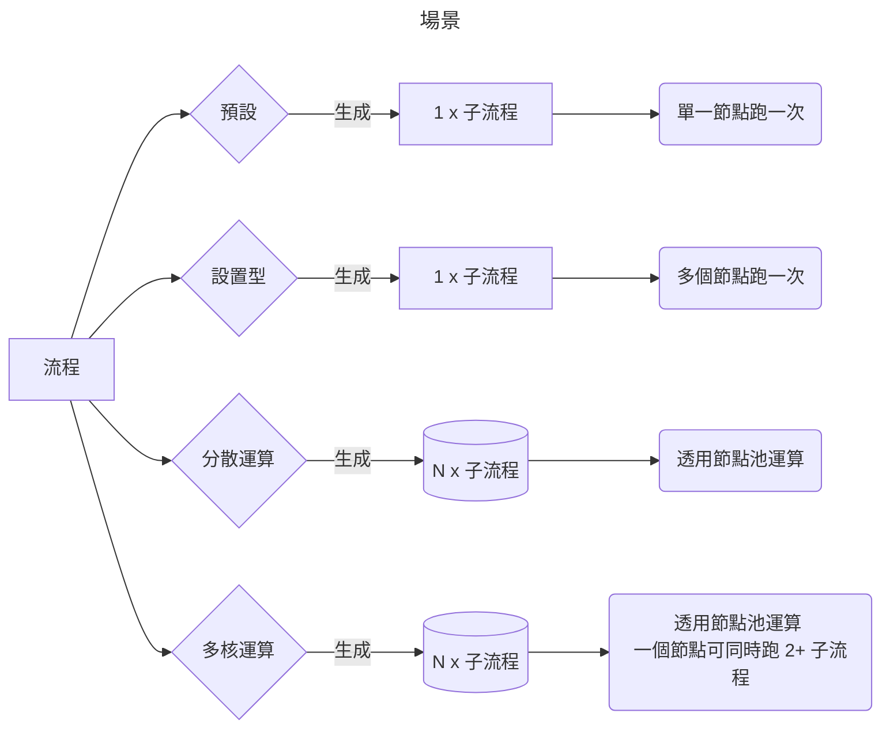

# 運作流程

這是專案的內容, 分爲好幾層

## 專案

專案容器, 你可以給予名稱跟敘述, 方便管理的資料結構

## 流程

這大概是最重要的部分, 定義流程  
專案可以有多個流程  
每個流程可以有不同的設定  
目前支援 4 種設定

* 預設
* 設置型
* 分散運算
* 多核運算

!!! note "預設場景"
    後台會挑一台節點跑一次流程, 然後直接標記爲完成

#### 設置型

你想要所有節點跑一次流程

!!! warning "節點離線狀況"
    如果一個節點處於離線狀態, 後台將會一直等待重新連線, 直到拿到任務回傳

#### 分散運算

根據輸入的數字參數, 後台會建立清單, 一個一個運算直到全部跑完  
子流程會根據輸入的數字參數建立, 如果輸入的數字是 5, 那將會有 5 個子流程產生

#### 多核運算

根據輸入的數字參數, 運算單元會設置最高単一節點可以程載的任務上限  
如果輸入的數字是 4, 而且分散運算也打開, 那麼單一節點會同時被派送 4 個任務

這個選項對於低算力需求的工作很有幫助, 像是賦予影片 metadata 

## 工作

流程的內容  
流程下可以有多個工作任務

順帶一提, Verteilen 目前支援 Javascript 腳本的邏輯編寫

#### 表達式

目前屬性使用了 [表達式](https://www.npmjs.com/package/expressionparser) NPM 插件進行運算  
重點是讓不同的情況能得到不同的結果

## 資料庫

用於運算流程的數據庫  
你也可以在運算期間變更數據內容, 後台會建立一個副本, 所以不會影響到
