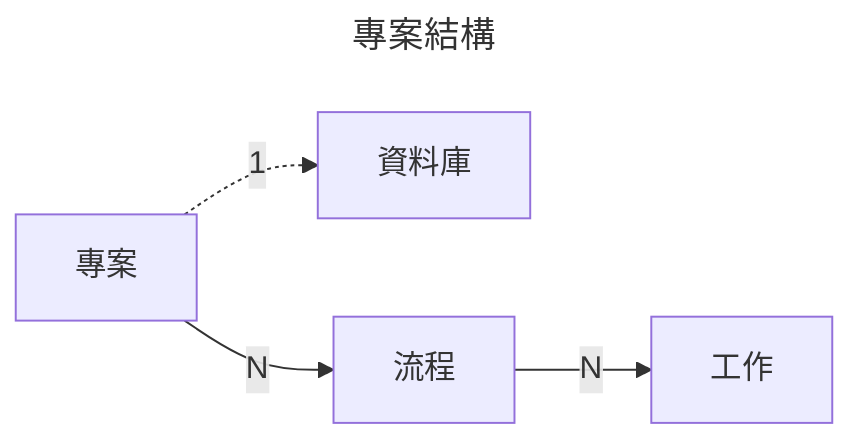
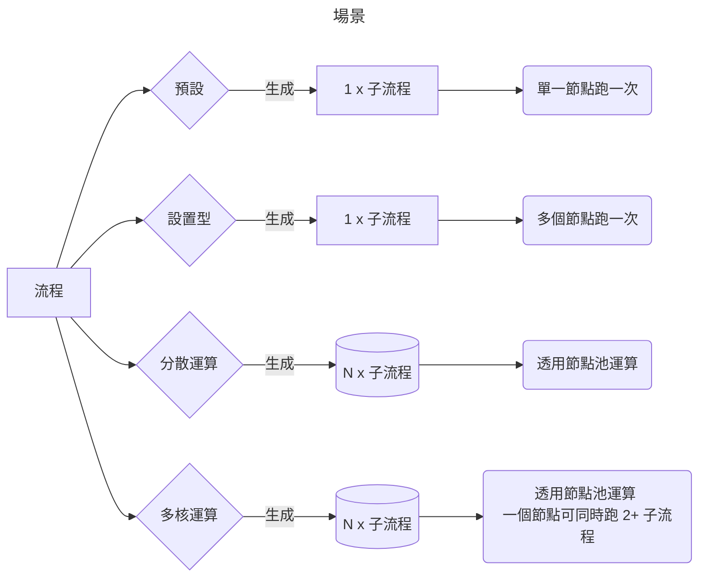

# 運作流程

這是專案的內容, 分爲好幾層

## 專案

The project container, you can put name and description in here, just easy to manage.

## 流程

This probably the most important part, defining tasks  
A project can have multiple task  
Every task can have different flags  
Currently Verteilen support 3 flags

* No Flags
* Setup
* Cluster
* Multithread

!!! note "No Flag Scenario"
    The backend will pick only one compute node, and run the task, then it will mark it as finish

#### 設置型

You want every compute node run once

!!! warning "Compute Node Offline Scenario"
    If one of the compute node is offline, backend will keep waiting for it to back online to do the task

#### 分散運算

Base on the input number, it will create a queue, and run it one by one, until all the subtask finish  
Subtesk create base on the input number, if input is 5, then it will have 5 subtask create

#### 多核運算

Base on the input number, It will set the thread running upper-limit for a single compute node  
If the input is 4, and if cluster flag is on as well, then a single node can run 4 subtasks at once

This is useful for low compute task such as small file converting or apply metadata for a video file

## 工作

The content of the task  
A task can have multiple jobs

By the way, Verteilen currently support use Javascript VM to write the logic here

#### 表達式

## 資料庫

