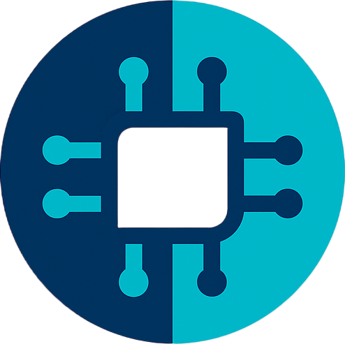

# Welcome Verteilen Documentation

Verteilen is a cluster computing application which provide friendly user interface to control with

## Application info

* Platform Support: Windows / Linux
* Programming Language: Typescript
* Framework: NodeJS, Electron, Vue, Vuetify
* Script Language: JS
* Author: Elly
