# Project

A container which holds the information about the tasks schedule configuration

## Overview

For manage the project, you want to enter the project page

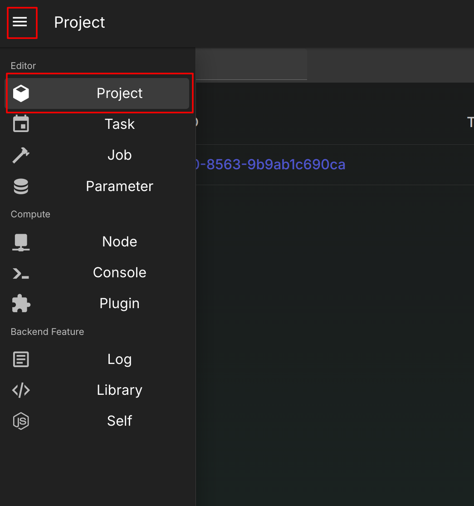

In this page, you can do everything in the action bar

* Added project
* Export project
* Select all project
* etc...

The buttons itself contain popup menu, so it should be fine to read them

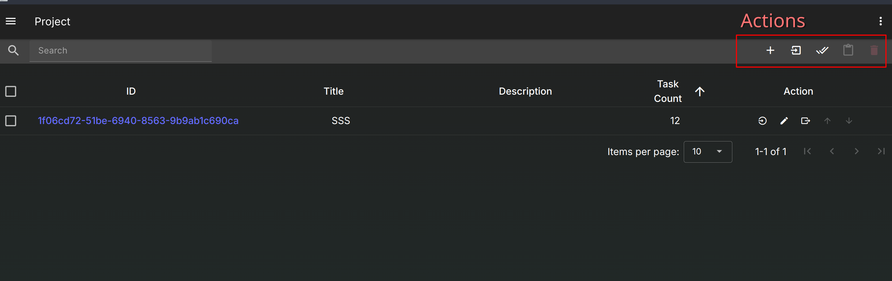

Click the UUID to quickly enter the task scheduler manage page

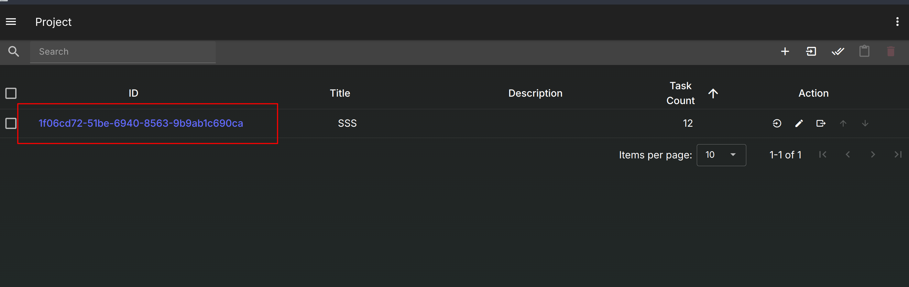

## Add New Project

Let's Trying to added a project

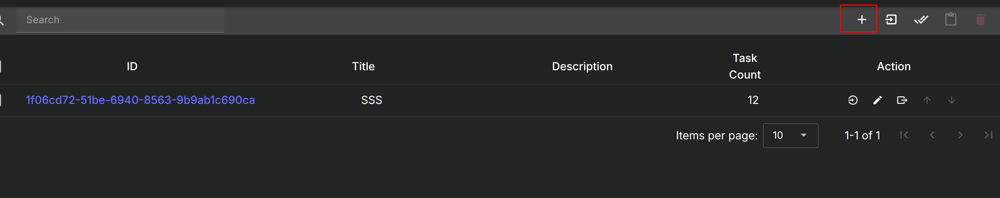
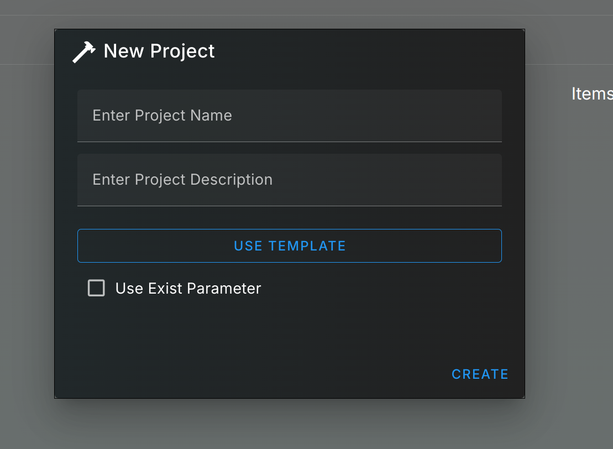

As you can see, you must enter the name, otherwise the menu will not accept

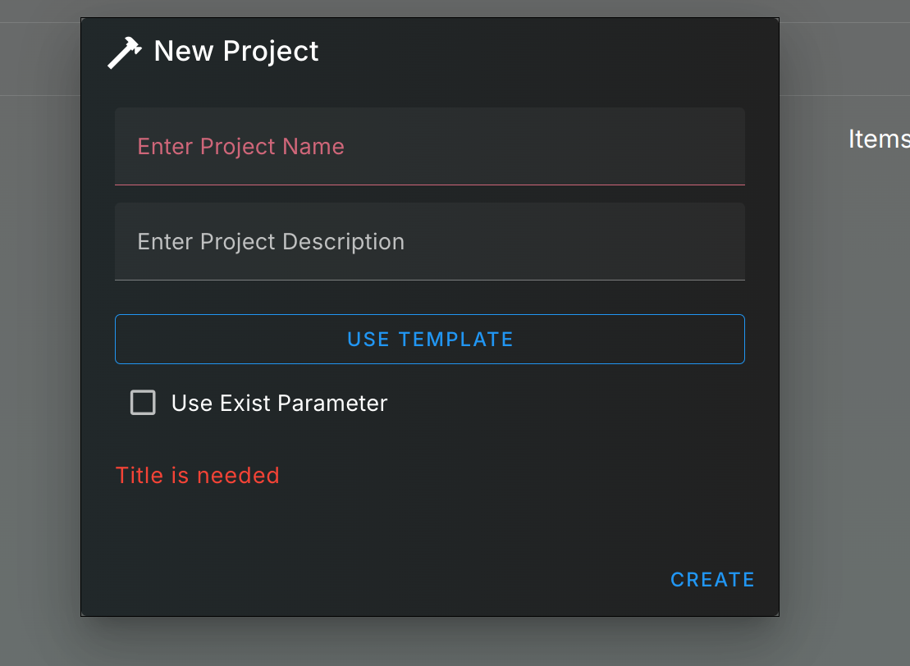

Next, We can choose template for the task schedule as well  
if you did not choose, this will create a blank project with 0 task in it

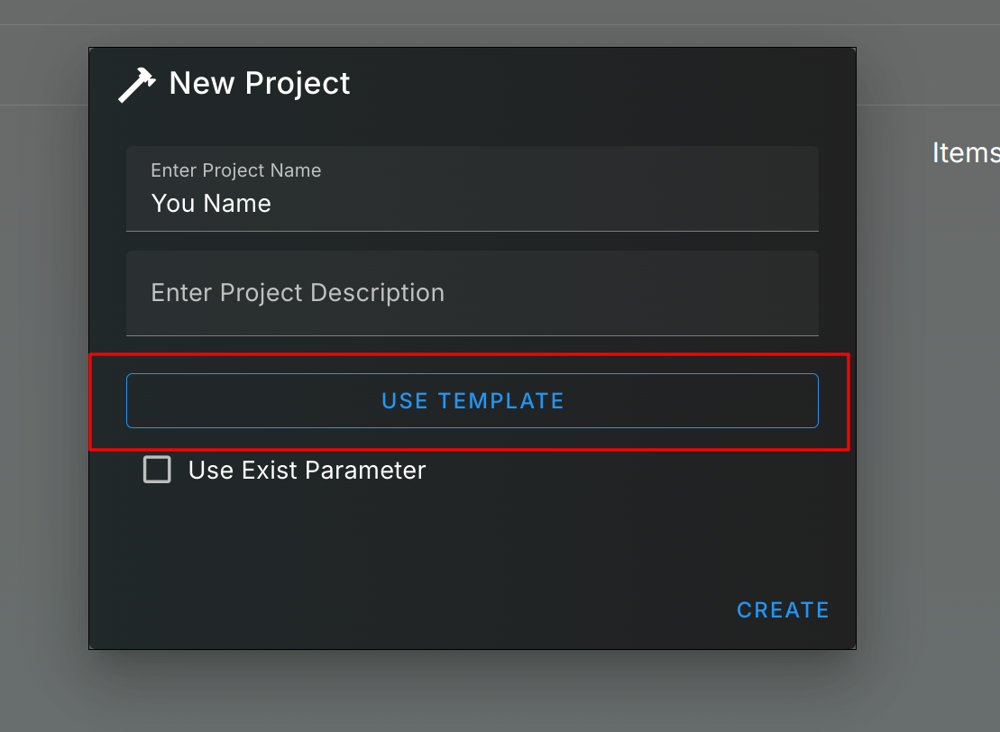

The template select menu here, you can open the group, choose the one  
Once anything is select, confirm button will light up  
It means it's good to go

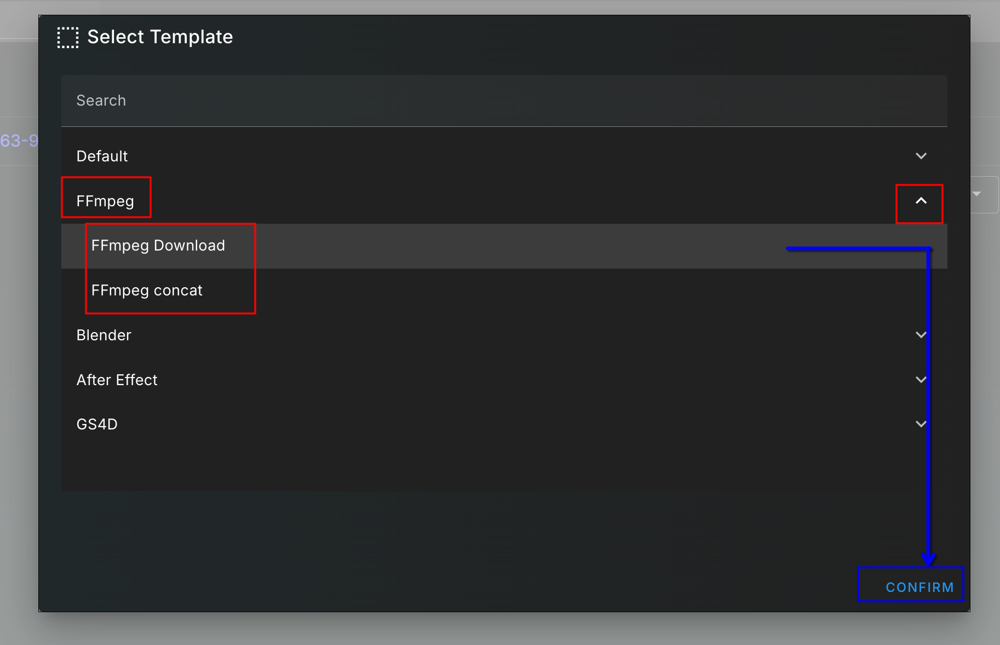

The template button will change the text to which one you select

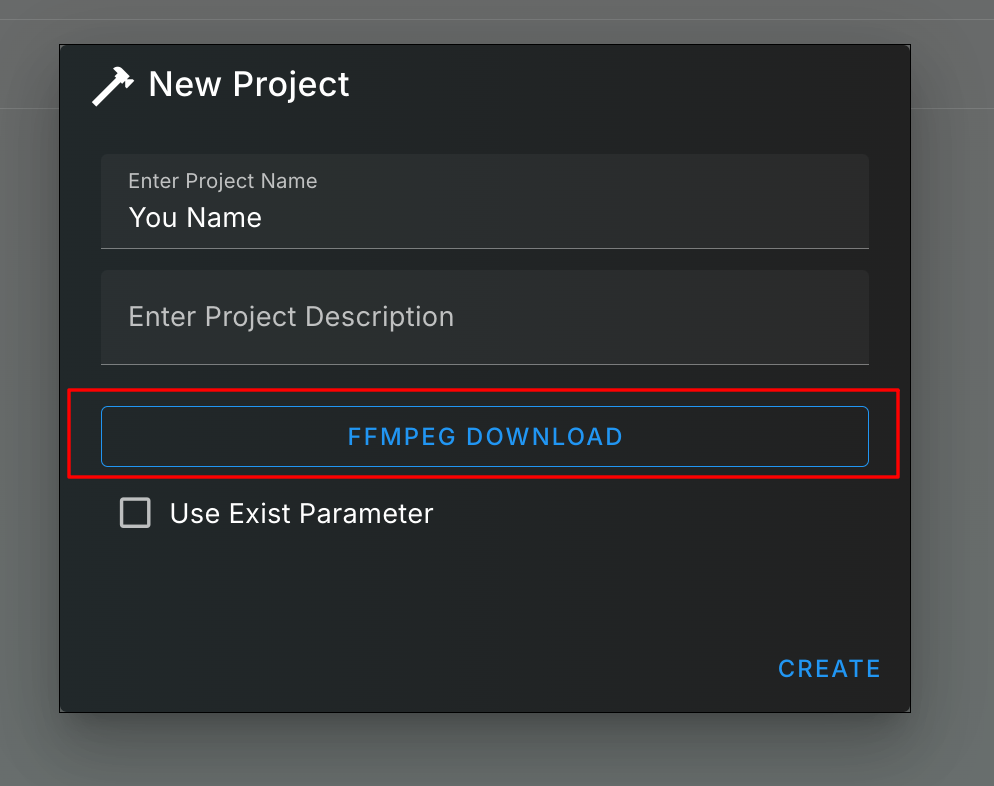

You can choose the default binding parameter in here as well

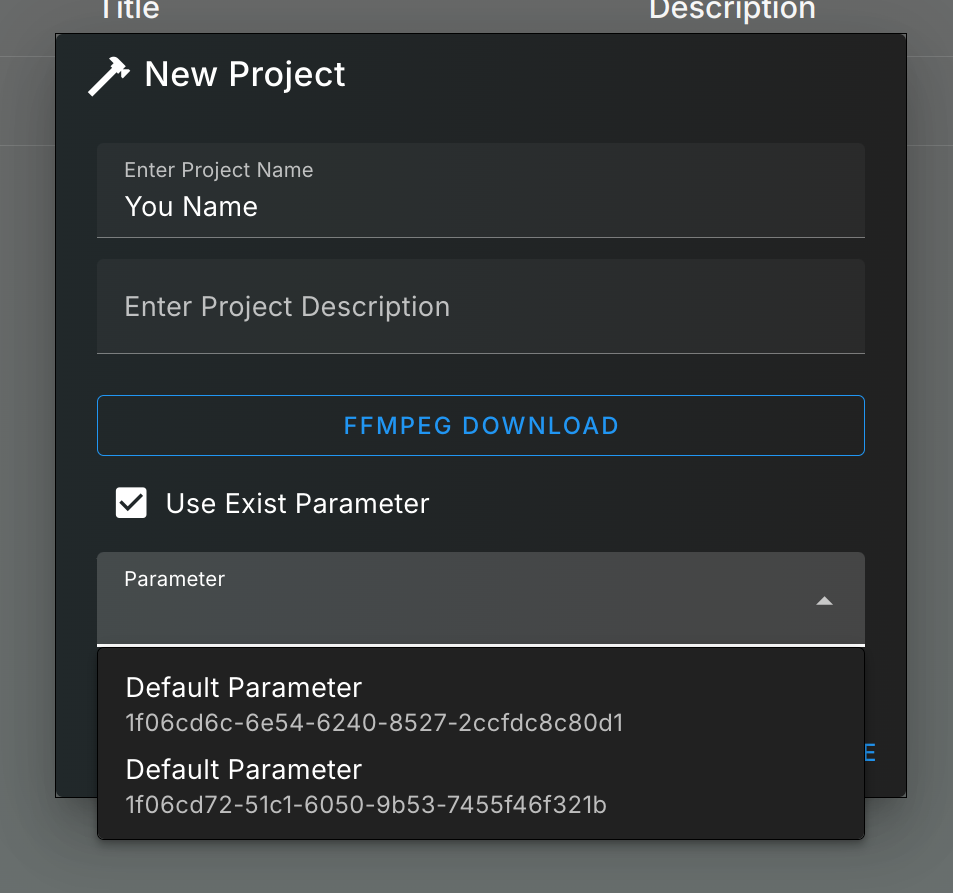

After finish, you hit "create"  
The list popup the one you just create, and once there is 2 items in the list  
You can actually change its order

!!! warning "The order"
    You can change to order, but if you have any sorting config in place  
    You will not see the order change  
    **So if you want to change the order, make sure you cancel the sorting setting first**

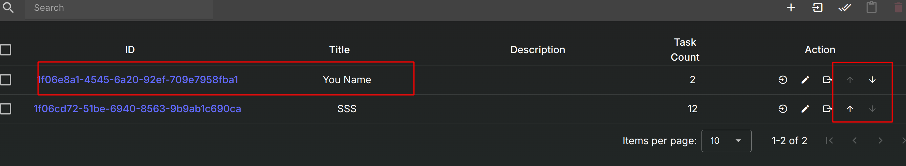